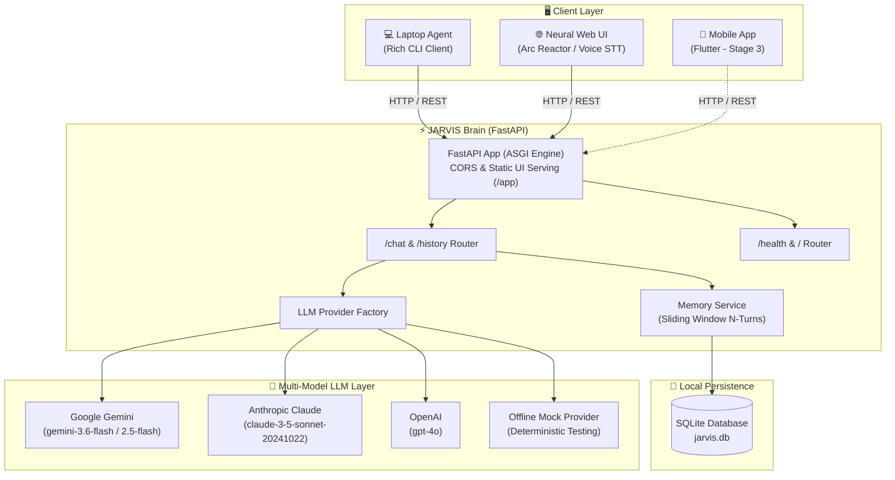

<div align="center">

# ⚡ Personal J.A.R.V.I.S.
### *Just A Rather Very Intelligent System*

[](https://www.python.org/)
[](https://fastapi.tiangolo.com/)
[](http://127.0.0.1:8000/app)
[](https://ai.google.dev/)
[](https://www.anthropic.com/)
[](https://openai.com/)
[](https://www.sqlite.org/)
[](LICENSE)

<p align="center">
  <b>A high-performance, modular, multi-device personal AI assistant ecosystem. Powered by a central FastAPI backend "Brain", stateful sliding-window SQLite memory, multi-provider LLM orchestration (Google Gemini, Claude, GPT-4o, Offline Mock), a futuristic Neural Web Interface with animated Arc Reactor HUD & Voice STT, and an interactive Rich terminal client.</b>
</p>

[Key Features](#-key-features) •
[Web Interface](#-neural-web-interface-showcase) •
[Architecture](#-system-architecture) •
[Quickstart](#-quickstart-guide) •
[CLI Commands](#-cli-commands) •
[API Reference](#-api-reference) •
[Configuration](#-configuration-reference) •
[Roadmap](#-project-roadmap)

</div>

---

## 🌟 Key Features

- **🌐 Futuristic Neural Web Interface**: High-tech cyber dashboard featuring an animated rotating **Arc Reactor SVG**, audio waveform animations, and a 4-tab tactical workspace (**Chat**, **Actions**, **Memory**, **System Diagnostics**).
- **🎙️ Real-time Voice Directives (Speech-to-Text)**: Hands-free voice recognition powered by the browser Web Speech API, embedded inside a glowing breathing reactor mic pill.
- **🧠 Centralized Intelligence Brain**: Asynchronous FastAPI backend providing unified state management, OpenAPI specifications (`/docs`), automated health monitoring (`/health`), and static web serving at `/app`.
- **🔄 Multi-LLM Provider Engine**: Hot-swap between **Google Gemini** (`google-genai` SDK / `gemini-3.6-flash`), **Anthropic Claude** (`claude-3-5-sonnet`), and **OpenAI** (`gpt-4o`) via a single `.env` setting (`LLM_PROVIDER`).
- **🛡️ Zero-Config Offline Mock Mode**: Built-in deterministic mock provider automatically engages if API keys are missing or invalid, enabling instant offline development and automated CI testing with zero cloud fees.
- **💾 Stateful Sliding-Window Memory**: Local SQLite persistence via SQLAlchemy ORM (`jarvis.db`). Logs complete conversation transcripts while passing a configurable sliding window of the last *N* turns to LLM prompts for long-term dialogue continuity.
- **🔀 Multi-Session & Device Partitioning**: Isolate workflows into distinct concurrent sessions (e.g. `default`, `coding`, `planning`, `research`) with client device tags (`laptop`, `mobile`, `web_neural_client`, `jarvis_brain`).
- **🔊 Zero-Dependency Web Audio Synthesizer**: Custom synthesized futuristic HUD sound effects for message transmit, receive, session switching, and memory flush using the browser Web Audio API.
- **💻 Interactive Rich Terminal Client**: Full-featured desktop CLI built with [Rich](https://github.com/Textualize/rich)—complete with formatted panels, rendered Markdown, tabular history, session switching, and slash commands.
- **🔒 100% Local Data Sovereignty**: All conversation history resides locally on your machine in SQLite. Zero cloud tracking, zero external database dependencies.

---

## 🖥️ Neural Web Interface Showcase

The Web Interface is served directly from the FastAPI backend at **`http://127.0.0.1:8000/app`** (or can be opened directly as `frontend/index.html`):

```
+-----------------------------------------------------------------------------------+
|  [⚡ Arc Reactor]  J.A.R.V.I.S.  ● ONLINE      [Session: default]  [🔊]  [AX]     |
+-----------------------------------------------------------------------------------+
|  Provider: Gemini (gemini-3.6-flash)  |  Context: 4 turns  |  Latency: 0.8s       |
+-----------------------------------------------------------------------------------+
|                                                                                   |
|  [CLIENT • 10:41 AM]                                                              |
|  +-----------------------------------------------------------------------------+  |
|  | [||| Voice Waveform] Jarvis, summarize today's git commits and open VS Code. |  |
|  +-----------------------------------------------------------------------------+  |
|                                                                                   |
|  [J.A.R.V.I.S. // EXEC • NODE-01 • gemini-3.6-flash]                               |
|  +-----------------------------------------------------------------------------+  |
|  | Good morning, Alex. Found 4 commits today across main and feature/chat-memory.  |
|  | Launching Visual Studio Code in ~/workspace/alex-dev.                       |  |
|  |                                                                             |  |
|  | [Copy] ```python                                                            |  |
|  | def run_diagnostic():                                                       |  |
|  |     return {"status": "nominal", "subsystems": "online"}                    |  |
|  | ```                                                                         |  |
|  +-----------------------------------------------------------------------------+  |
|                                                                                   |
|  [Suggested Directives: ⚡ System Status | 🧠 Explain Memory | 💻 Script Gen]    |
|  +-----------------------------------------------------------------------------+  |
|  | [ (●) Arc Mic ] > Transmit command to Jarvis...                [ ↑ Send ]   |  |
|  +-----------------------------------------------------------------------------+  |
+-----------------------------------------------------------------------------------+
|            [ 💬 Chat ]      [ ⚡ Actions ]      [ 💾 Memory ]      [ ⚙️ System ]     |
+-----------------------------------------------------------------------------------+
```

### Key Modules in the Web Frontend:
1. **💬 Chat Tab**:
   - Live conversational stream with user bubbles and audio waveform animation.
   - Jarvis operational responses with Markdown rendering and syntax-highlighted code blocks with one-click "Copy Code" buttons.
   - One-click suggested directive chips.
   - Voice Input button with Web Speech API integration and pulsing listening states.
2. **⚡ Actions Tab**:
   - Diagnostic probes, memory context dumps, test suite query triggers.
   - Live console telemetry output stream.
3. **💾 Memory Tab**:
   - Interactive SQLite transcript explorer displaying all messages stored in `jarvis.db`.
   - Session switcher & creator (`default`, `coding`, `planning`, `research`).
   - Atomic session memory flush button (`DELETE /history/{session_id}`).
4. **⚙️ System Tab**:
   - Live backend health inspector polling `/health`.
   - Custom backend URL configuration (connects to localhost, cloud Render, or remote VPS).
   - System architecture specifications and audio synthesis volume control.

---

## 🏛️ System Architecture

### Component Diagram



### Architecture Flow

```
                               +--------------------------------------------+
                               |          Central Backend "Brain"           |
                               |          (FastAPI / Python 3.10+)          |
                               +--------------------------------------------+
                                      /              |               \
                                     /               |                \
                                    v                v                 v
                       +-------------------+  +--------------+  +-------------------+
                       |  SQLite Database  |  |  Memory Svc  |  |   LLM Providers   |
                       |    (jarvis.db)    |  |   (Sliding   |  | - Google Gemini   |
                       |  SQLAlchemy ORM   |  |   Window N)  |  | - Anthropic Claude|
                       +-------------------+  +--------------+  | - OpenAI GPT-4o   |
                                     ^               ^          | - Offline Mock    |
                                     |               |          +-------------------+
                       [REST: POST /chat, GET /history, DELETE /history]
                         /           |                      \
                        v            v                       v
               +---------------+  +--------------------+  +--------------------+
               | Neural Web UI |  |    Laptop Agent    |  |     Mobile App     |
               | (Arc Reactor) |  |  (Rich CLI Client) |  | (Flutter - Stage 3)|
               +---------------+  +--------------------+  +--------------------+
```

---

## 📁 Project Structure

```
JARVIS/
├── backend/
│   ├── app/
│   │   ├── models/
│   │   │   ├── __init__.py
│   │   │   └── message.py         # SQLAlchemy message model (role, device, session)
│   │   ├── routers/
│   │   │   ├── __init__.py        # Router exports
│   │   │   ├── chat.py            # /chat, /history/{session_id} endpoints
│   │   │   └── health.py          # /health diagnostics endpoint
│   │   ├── schemas/
│   │   │   ├── __init__.py
│   │   │   └── chat.py            # Pydantic request & response validation schemas
│   │   ├── services/
│   │   │   ├── __init__.py
│   │   │   ├── llm.py             # Gemini, Claude, OpenAI, and Mock providers
│   │   │   └── memory.py          # Sliding-window context assembly & persistence
│   │   ├── __init__.py
│   │   ├── config.py              # Application settings, persona, and .env loader
│   │   ├── database.py            # SQLite engine, sessionmaker, and init_db
│   │   └── main.py                # FastAPI app, static /app mount, CORS, lifespan
│   ├── .env.example               # Backend configuration template
│   └── requirements.txt           # Backend core dependencies
├── frontend/
│   ├── index.html                 # Tactical animated HUD interface (Arc Reactor, Voice STT)
│   └── app.js                     # Real-time API link, Web Audio tones, tab manager
├── laptop_agent/
│   ├── __init__.py
│   ├── cli.py                     # Rich interactive terminal chat interface
│   ├── config.py                  # Laptop agent runtime settings
│   └── requirements.txt           # Laptop agent dependencies (rich, requests)
├── tests/
│   ├── __init__.py
│   └── test_chat.py               # Integration test suite (memory, sessions, health, web)
├── .env.example                   # Root environment configuration template
├── .env                           # Active environment variables (gitignored)
├── .gitignore                     # Repository hygiene & exclusion rules
├── jarvis.db                      # Local SQLite database (created on first run)
└── README.md                      # Project documentation
```

---

## 🚀 Quickstart Guide

### Prerequisites

- **Python**: Version `3.10` or newer (Tested on Python 3.10 through Python 3.14).
- **API Key** *(Optional)*: Google AI Studio (`GEMINI_API_KEY`), Anthropic (`ANTHROPIC_API_KEY`), or OpenAI (`OPENAI_API_KEY`).
  > If no API key is set, JARVIS will automatically start in **Mock Mode** for full local testing.

---

### 1. Clone & Prepare Virtual Environment

#### Windows (PowerShell / Command Prompt):
```powershell
# Clone or enter repository directory
cd JARVIS

# Create virtual environment
python -m venv .venv

# Activate virtual environment
.venv\Scripts\activate
```

#### macOS / Linux:
```bash
# Clone or enter repository directory
cd JARVIS

# Create virtual environment
python3 -m venv .venv

# Activate virtual environment
source .venv/bin/activate
```

---

### 2. Install Dependencies

Install requirements for both the backend brain and the laptop client:

```bash
python -m pip install --upgrade pip
python -m pip install -r backend/requirements.txt
python -m pip install -r laptop_agent/requirements.txt
```

---

### 3. Configure Environment Variables

Create your local `.env` configuration from the provided template:

```bash
# Windows
copy .env.example .env

# macOS / Linux
cp .env.example .env
```

Open `.env` and set your preferred LLM provider:

```ini
# Choose: 'gemini', 'anthropic', 'openai', or 'mock'
LLM_PROVIDER=gemini

# Primary Provider Keys (choose whichever you use)
GEMINI_API_KEY=your_gemini_api_key_from_google_ai_studio
ANTHROPIC_API_KEY=your_anthropic_api_key_here
OPENAI_API_KEY=your_openai_api_key_here

# Active Model Name
LLM_MODEL=gemini-3.6-flash

# Sliding Window: Number of historical turns retained in context
MAX_HISTORY_MESSAGES=10

# Database & Server
DATABASE_URL=sqlite:///./jarvis.db
HOST=0.0.0.0
PORT=8000
DEBUG=True

# Laptop Agent Client
JARVIS_BACKEND_URL=http://127.0.0.1:8000
```

---

### 4. Run Automated Tests

Execute the automated pytest suite verifying database persistence, context preservation, session isolation, health checks, and web static serving:

```bash
# Run test suite
python -m pytest tests/ -v
```

> **Tip**: To run tests strictly offline against the mock provider regardless of your `.env`:
> ```bash
> # Linux/macOS
> LLM_PROVIDER=mock python -m pytest tests/ -v
> # Windows PowerShell
> $env:LLM_PROVIDER="mock"; python -m pytest tests/ -v; Remove-Item Env:\LLM_PROVIDER
> ```

---

### 5. Launch the Backend Brain

Start the FastAPI ASGI server with auto-reload:

```bash
python -m uvicorn backend.app.main:app --reload --port 8000
```

- 🌐 **Service Root**: [http://127.0.0.1:8000/](http://127.0.0.1:8000/)
- ⚡ **Neural Web Interface**: [http://127.0.0.1:8000/app](http://127.0.0.1:8000/app)
- 🩺 **Health Check**: [http://127.0.0.1:8000/health](http://127.0.0.1:8000/health)
- 📚 **Swagger UI Docs**: [http://127.0.0.1:8000/docs](http://127.0.0.1:8000/docs)
- 📖 **ReDoc Documentation**: [http://127.0.0.1:8000/redoc](http://127.0.0.1:8000/redoc)

---

### 6. Access the Neural Web Frontend

Once the backend server is running, open your web browser to:
👉 **[http://127.0.0.1:8000/app](http://127.0.0.1:8000/app)**

*(You can also double-click and open `frontend/index.html` directly in any browser).*

*Interactive Highlights:*
- **Animated Arc Reactor**: Real-time rotating tech rings and pulsing core status vector.
- **Voice Directives (Speech-to-Text)**: Click the glowing reactor mic button to speak directives directly to Jarvis.
- **Markdown & Code Highlighting**: Syntax-highlighted code blocks with one-click copy buttons.
- **Multi-Tab Navigation**: Switch between **Chat**, **Actions**, **Memory**, and **System Diagnostics**.
- **Context Inspection**: Live SQLite message transcript explorer and session switcher (`default`, `coding`, `research`).

---

### 7. Launch the Laptop Agent CLI (Alternative)

In a separate terminal window (with `.venv` active):

```bash
python laptop_agent/cli.py
```

You will see the interactive terminal interface:

```text
╭────────────────────────────── ⚡ J.A.R.V.I.S. — Laptop Client ⚡ ──────────────────────────────╮
│ Backend: http://127.0.0.1:8000  |  Device: laptop  |  Session: default                       │
│ Commands: /history, /clear, /session <id>, /help, /exit                                      │
╰─────────────────────────────────────────────────────────────────────────────────────────────╯
● Connected to JARVIS Brain successfully.

[default] You > Hello Jarvis, my name is Bruce.
╭─ Jarvis (provider: gemini (gemini-3.6-flash) | context: 0 turn(s)) ─────────────────────────╮
│ Good day, Bruce. Jarvis systems nominal and ready. What can I do for you today?             │
╰─────────────────────────────────────────────────────────────────────────────────────────────╯
[default] You > What is my name?
╭─ Jarvis (provider: gemini (gemini-3.6-flash) | context: 2 turn(s)) ─────────────────────────╮
│ Your name is Bruce, sir.                                                                    │
╰─────────────────────────────────────────────────────────────────────────────────────────────╯
```

---

## 💬 CLI Commands

The interactive terminal client supports built-in management commands:

| Command | Description | Example |
| :--- | :--- | :--- |
| `<your message>` | Send natural language query or prompt to Jarvis | `Explain quantum computing in 2 sentences.` |
| `/history` | Display a formatted Rich table with chronological message history | `/history` |
| `/clear` | Purge all stored messages for the active session (resets memory) | `/clear` |
| `/session <id>` | Switch the active context session (creates or resumes session) | `/session coding_work` |
| `/help` | Print list of available client commands | `/help` |
| `/exit` or `/quit` | Cleanly disconnect and exit the terminal client | `/exit` |

---

## 📡 API Reference

JARVIS provides a clean, stateless REST API documented via OpenAPI.

### 1. `POST /chat` — Send Message & Receive Response

**Request Body:**
```json
{
  "message": "Hello Jarvis, summarize our project roadmap.",
  "session_id": "default",
  "device_id": "laptop"
}
```

**Response (`200 OK`):**
```json
{
  "response": "Understood, sir. Here is the summary of your current project roadmap...",
  "session_id": "default",
  "message_id": 42,
  "history_count": 4,
  "provider": "gemini (gemini-3.6-flash)"
}
```

#### cURL Example:
```bash
curl -X POST "http://127.0.0.1:8000/chat" \
     -H "Content-Type: application/json" \
     -d '{
       "message": "Hello Jarvis",
       "session_id": "my_session",
       "device_id": "laptop"
     }'
```

---

### 2. `GET /history/{session_id}` — Retrieve Session Transcript

**Response (`200 OK`):**
```json
{
  "session_id": "default",
  "total_messages": 2,
  "messages": [
    {
      "id": 1,
      "session_id": "default",
      "device_id": "laptop",
      "role": "user",
      "content": "Hello Jarvis",
      "created_at": "2026-09-06T13:15:00Z"
    },
    {
      "id": 2,
      "session_id": "default",
      "device_id": "jarvis_brain",
      "role": "assistant",
      "content": "Good day, sir. Systems operational.",
      "created_at": "2026-09-06T13:15:01Z"
    }
  ]
}
```

---

### 3. `DELETE /history/{session_id}` — Clear Session Memory

Purges all messages for the specified session from SQLite.

**Response (`200 OK`):**
```json
{
  "status": "success",
  "session_id": "default",
  "deleted_messages_count": 2
}
```

---

### 4. `GET /health` — Diagnostics & Configuration

**Response (`200 OK`):**
```json
{
  "status": "healthy",
  "service": "JARVIS Brain Backend",
  "version": "0.1.0",
  "llm_provider": "gemini",
  "llm_model": "gemini-3.6-flash",
  "max_history_messages": 10
}
```

---

### 5. `GET /app` — Web Application Entry Point

Returns the interactive HTML5/CSS3 Neural Web Client interface.

---

## ⚙️ Configuration Reference

All settings can be customized via `.env` or system environment variables:

| Variable | Type | Default | Description |
| :--- | :--- | :--- | :--- |
| `LLM_PROVIDER` | `string` | `gemini` | LLM backend to use: `gemini`, `anthropic`, `openai`, or `mock`. |
| `GEMINI_API_KEY` | `string` | *None* | Google AI Studio API key (`GOOGLE_API_KEY` also supported). |
| `ANTHROPIC_API_KEY` | `string` | *None* | Anthropic Claude API key (`sk-ant-...`). |
| `OPENAI_API_KEY` | `string` | *None* | OpenAI API key (`sk-...`). |
| `LLM_MODEL` | `string` | `gemini-3.6-flash` | Model identifier (e.g. `gemini-3.6-flash`, `claude-3-5-sonnet-20241022`, `gpt-4o`). |
| `MAX_HISTORY_MESSAGES` | `integer` | `10` | Total previous conversation turns included in LLM context. |
| `SYSTEM_PROMPT` | `string` | *(Built-in)* | System persona instructing Jarvis tone and behaviors. |
| `DATABASE_URL` | `string` | `sqlite:///./jarvis.db`| SQLAlchemy connection URI for SQLite database. |
| `HOST` | `string` | `0.0.0.0` | Backend bind host address. |
| `PORT` | `integer` | `8000` | Backend bind port. |
| `DEBUG` | `boolean` | `True` | Enable debug logs and uvicorn auto-reloading. |
| `JARVIS_BACKEND_URL` | `string` | `http://127.0.0.1:8000`| URL used by Laptop Agent to connect to backend brain. |
| `JARVIS_DEVICE_ID` | `string` | `laptop` | Default device identifier tagged on client messages. |
| `JARVIS_SESSION_ID` | `string` | `default` | Default session identifier opened upon client launch. |

---

## 🏛️ Architectural Decisions & Trade-offs

### 1. Database: SQLite vs. PostgreSQL
- **Stage 1 Choice**: **SQLite** via SQLAlchemy ORM.
  - *Why*: Zero infrastructure setup, instant read/write latency, trivial single-file backups (`jarvis.db`), and zero host memory footprint. Ideal for single-user sovereignty.
  - *When to migrate*: Transition to PostgreSQL when deploying multi-user clusters, cloud serverless runtimes (Render, Fly.io, AWS ECS), or when concurrent write contention becomes a factor.

### 2. Communication: REST vs. WebSockets / SSE
- **Stage 1 Choice**: **REST API** (`POST /chat`, `GET /history`, `DELETE /history`).
  - *Why*: Simple, reliable, inspectable in Swagger UI (`/docs`), curl-friendly, and stateless.
  - *Next Evolution (Stage 2 & 3)*: Server-Sent Events (SSE) or WebSockets will be introduced to stream LLM tokens word-by-word and push proactive desktop action events asynchronously to the laptop agent.

### 3. Multi-Provider Abstraction & Graceful Mocking
- Built on a decoupled `BaseLLMProvider` interface.
- Automatically falls back to `MockProvider` if credentials are blank or placeholders (`your_...`), ensuring new developers can clone, boot, and test the entire stack immediately without signing up for paid API services.

---

## 🗺️ Project Roadmap

- [x] **Stage 1 — MVP Backend & Clients** *(Current)*
  - [x] FastAPI asynchronous backend brain
  - [x] SQLite conversation memory with sliding-window context
  - [x] Multi-LLM provider abstraction (Google Gemini, Anthropic Claude, OpenAI, Mock)
  - [x] Neural Web Interface (Animated Arc Reactor SVG, Voice STT, 4 Tabs, Markdown)
  - [x] Interactive Rich terminal client with slash commands and history viewer
  - [x] Automated pytest integration test suite
- [ ] **Stage 2 — Local Desktop Actions & Tool Calling**
  - [ ] LLM function / tool calling schema
  - [ ] Desktop action executor (`open_app`, `run_command`, `search_filesystem`, `system_info`)
  - [ ] Strict path whitelisting, permission prompts, and sandboxing
- [ ] **Stage 3 — Cross-Device Mobile App**
  - [ ] Flutter iOS/Android client
  - [ ] Shared token authentication
  - [ ] Real-time cross-device session resumption
- [ ] **Stage 4 — Automations & Background Scheduling**
  - [ ] APScheduler engine for cron routines
  - [ ] Proactive morning briefings & weather/calendar integrations
  - [ ] Autonomous trigger-action rules
- [ ] **Stage 5 — Real-time Voice Pipeline**
  - [ ] Local Whisper STT pipeline
  - [ ] Low-latency Text-to-Speech (TTS) voice playback

---

## 🧪 Testing & Validation

To run all unit and integration tests:

```bash
# Run with verbose output
python -m pytest tests/ -v

# Run fast with mock provider
LLM_PROVIDER=mock python -m pytest tests/ -v
```

---

## 🤝 Contributing

1. Fork the repository
2. Create your feature branch (`git checkout -b feature/amazing-feature`)
3. Commit your changes (`git commit -m "Add amazing feature"`)
4. Push to the branch (`git push origin feature/amazing-feature`)
5. Open a Pull Request

---

## 📄 License

Distributed under the **MIT License**. See `LICENSE` for more information.

<div align="center">
  <sub>Built with ❤️ for personal productivity and intelligent automation.</sub>
</div>
